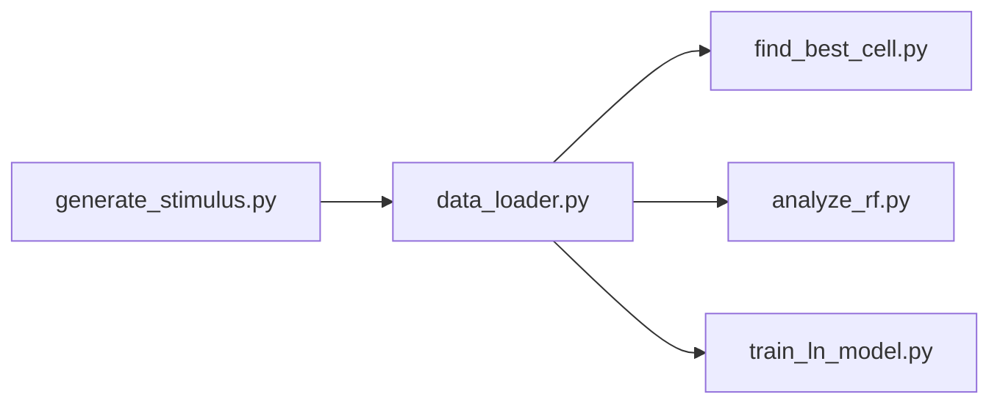

# Examination of Neural Networks Based on Biological Retina

A computational neuroscience project exploring retinal ganglion cell (RGC) encoding and neural network models inspired by biological vision processing.

## 📋 Overview

This repository contains:
- **Experimental Data**: Spike train recordings from mouse retinal ganglion cells
- **Computational Models**: Three state-of-the-art models for retinal processing
- **Educational Materials**: MIT lecture notes and research papers on vision systems

## 🧬 Data

### Karamanlis & Gollisch 2021 Dataset
Located in `data/10.12751_g-node.2j3d2i/`

Spike train data from mouse retinal ganglion cells under natural image stimulation.

**Source**: [Karamanlis D and Gollisch T (2021) Nonlinear spatial integration underlies the diversity of retinal ganglion cell responses to natural images. *J Neurosci* 41:3479-3498.](https://pubmed.ncbi.nlm.nih.gov/33664129/)

**Contents**:
- Multiple recording sessions (2017-2018)
- Spike times for individual cells
- Frame timing data
- Visual stimuli (natural images, gratings, noise patterns)

See `data/10.12751_g-node.2j3d2i/manual.pdf` for detailed documentation.

## 🧠 Models

### 1. CBEM (Conductance-based Encoding Model)
`Models/CBEM-master/`

A biophysically-inspired model that captures the conductance dynamics of retinal ganglion cells.

```bash
cd Models/CBEM-master
jupyter notebook exampleCBEMfitting.ipynb
```

### 2. Deep-Retina
`Models/deep-retina-master/`

Deep convolutional neural network models for predicting retinal responses.

```bash
cd Models/deep-retina-master/scripts
python fit_models.py --expt <expt> --stim <stim> --model BN_CNN
```

**Available models**: `BN_CNN`, `LN_softplus`, `LN_sigmoid`, `LN_relu`, `LN_rbf`

### 3. Wu Nature Communications 2024
`Models/wu-nature-comms-2024-master/`

State-of-the-art model for stimulus reconstruction from retinal responses.

```bash
cd Models/wu-nature-comms-2024-master
jupyter notebook SUBMISSION_flashed_reconstruction_demo.ipynb
```

## 🚀 Quick Start

1. **Verify installation**:
   ```bash
   cd Models
   python run_all_models.py
   ```

2. **Run a specific model** - see `Models/QUICK_START.md` for detailed instructions.

## 🔬 Custom Analysis Pipeline

A set of scripts for processing the Karamanlis dataset and training custom models.



### Scripts

| Script | Description |
|--------|-------------|
| `generate_stimulus.py` | Generates white noise stimulus using the ran1 RNG algorithm (compiles C++ for exact reproducibility) |
| `data_loader.py` | Synchronizes spike times with frame times and creates `training_dataset_wn.h5` |
| `find_best_cell.py` | Analyzes cells by spike count and recommends the most active cell |
| `analyze_rf.py` | Computes Spike-Triggered Average (STA) for receptive field mapping |
| `train_ln_model.py` | Trains a Linear-Nonlinear (LN) model using PyTorch with Poisson loss |

### Typical Workflow

```bash
cd Models

# Step 1: Generate the white noise stimulus (compiles and runs C++)
python generate_stimulus.py

# Step 2: Find the best cell to analyze
python find_best_cell.py

# Step 3: Prepare training data (syncs spikes with frames)
python data_loader.py

# Step 4: Analyze receptive field via STA
python analyze_rf.py

# Step 5: Train an LN model
python train_ln_model.py
```

## 📦 Requirements

- Python 3.11+
- NumPy, SciPy, Matplotlib
- TensorFlow/Keras (Deep-Retina)
- PyTorch (Wu Nature)
- JAX (CBEM)
- Jupyter Notebook

Install dependencies:
```bash
pip install numpy scipy matplotlib tensorflow torch jax h5py jupyter
```

## 📚 Educational Materials

The `Written-materials/` folder contains:
- MIT 9.40 Neural Computation lecture notes (Lectures 1-20)
- Research papers on retinal processing
- eLife publications on neural coding

## 📁 Project Structure

```
Retina-Comp-Project/
├── data/                          # Experimental spike train data
│   └── 10.12751_g-node.2j3d2i/   # Karamanlis & Gollisch 2021 dataset
├── Models/                        # Computational models
│   ├── CBEM-master/              # Conductance-based Encoding Model
│   ├── deep-retina-master/       # Deep neural network models
│   ├── wu-nature-comms-2024-master/  # Stimulus reconstruction
│   ├── generate_stimulus.py      # White noise stimulus generator
│   ├── data_loader.py            # Training data preparation
│   ├── find_best_cell.py         # Cell selection by spike count
│   ├── analyze_rf.py             # STA receptive field analysis
│   ├── train_ln_model.py         # LN model training (PyTorch)
│   ├── run_all_models.py         # Verification script
│   └── QUICK_START.md            # Model usage guide
└── Written-materials/            # Lectures and papers
```

## 📖 References

1. Karamanlis D & Gollisch T (2021). Nonlinear spatial integration underlies the diversity of retinal ganglion cell responses to natural images. *J Neurosci* 41:3479-3498.

2. McIntosh L, Maheswaranathan N, Nayebi A, Ganguli S, Baccus S (2016). Deep Learning Models of the Retinal Response to Natural Scenes. *NIPS*.

3. Wu Y et al. (2024). Neural decoding of natural images. *Nature Communications*.

## 📄 License

See individual model directories for their respective licenses.

## ✉️ Contact

For questions about the data, please refer to the original publications and datasets.

